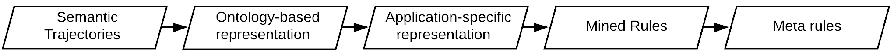

# Pipeline

## Semantic Trajectories

All data manipulation is done in `data.py` using the `TrajData` class and its subclasses. 

`TrajData` can be extended to support different data sources and enrich trajectory data with different semantics. All manipulations are heavily based in [pandas' DataFrames](https://pandas.pydata.org/).

For example, `FoursquareData` class uses `trajminer` lib to download Foursquare data and apply the following steps: 

- Filtering.
- Semantic enrichment of:
    - Trajectories.
    - Check-ins.

## Ontology-based representation

All ontology representation manipulation is done in `onto.py` (and the utility module `onto_mapping.py`, which should not need to be used by user code).

We use [owlready2](http://owlready2.readthedocs.io/) to programmatically manipulate ontologies. 

The output of the previous pipeline step can be converted to:
- [STEP](http://purl.org/net/step) representation.

    
    STEP ontology diagram.

## Application-specific representation

STEP can be dynamically converted to our proposed application-specific representation.

> Note that `./scripts/build_data.py` contains code that encapsulates all data building and representation steps (the first 3 steps of our pipeline).

### Pseudocode for converting from STEP

We use a systematic approach for converting the STEP representation to our Application-specific one. `Algorithm 1` below shows the main procedure. We denote our representation by the `converted:` prefix. 

`Algorithm 2` shows the auxiliary procedure for associating a Semantic Description to an entity using a relation. 

`Algorithm 3` shows how we process an Episode X's Contextual Elements (CEs). Note that there are three different behaviors:

1. If the CE is connected to an Episode Y (through an FOI entity), we directly connect the episodes X and Y;
2. Otherwise (i.e., the CE is connected to Semantic Descriptions, though an FOI entity):
    1. If the CE is a POI, then we create a POI entity and connect the semantic descriptions to it;
    2. Otherwise, we directly connect the episode X to the Semantic Descriptions.

## Mined Rules

AMIE 3 is available as a JAR package. It is invoked from the terminal to mine rules.

`analyzer.py` contains code to process the mined rules file and to generate multiple related-analysis.

## Metarules

AMIE 3 JAR can be directly used to generate a mapping from rules to metarules. Nonetheless, `analyzer.py` encapsulates this process and presents a better-formatted version (based in pandas.DataFrame).

`metarule_viz.py` contains code for visualizing metarules and examples.